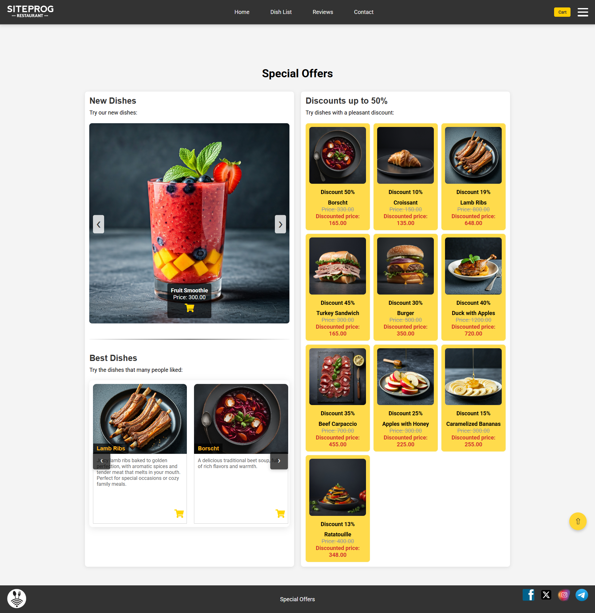
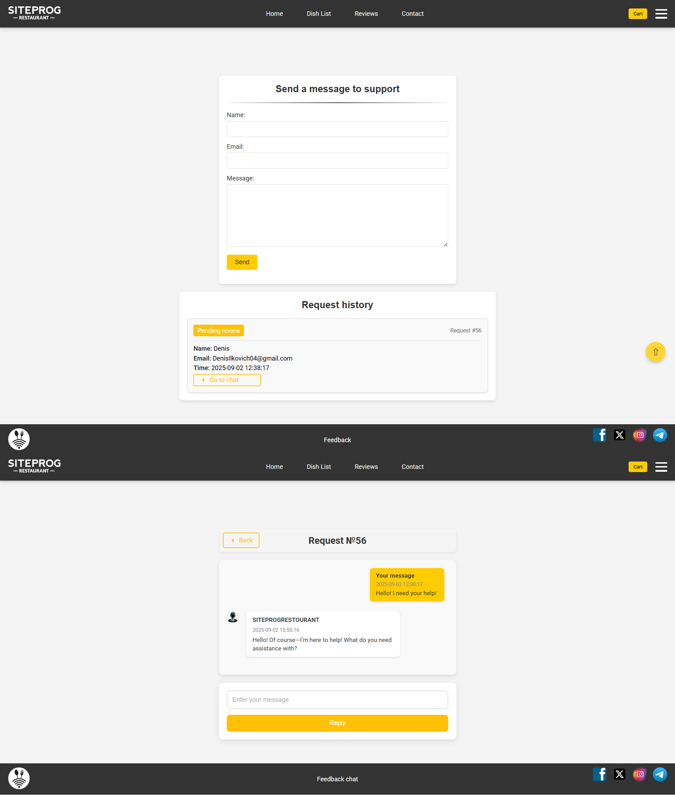

# RESTAURANT WEBSITE – ONLINE MENU & ORDER BOOKING

**SiteProgRestaurant** is a fully functional web application designed for modern restaurants, providing a convenient digital ordering process thanks to an adaptive user interface and a powerful admin panel. Built with Flask (Python) and SQLite, the platform features modular design, scalability, and a role-based interface, making it suitable for real business needs.

> **Author's Note:**  
> This project represents my first major full-stack application. During its development, I explored Flask, SQLite, and REST API design. Some parts of the code and project structure reflect my learning process, but the project demonstrates functional user and admin features.

---

## Table of Contents
- [Overview](#overview-)
- [Core Features](#core-features-)
- [Technologies](#technologies-)
- [Available Pages](#available-pages-)
  - [Home Page](#home-page)
  - [Promotions Section](#promotions-section-)
  - [Full Menu Catalog](#full-menu-catalog-)
  - [Cart & Checkout](#cart--checkout-)
  - [User Profile](#user-profile-)
  - [Reviews Page](#reviews-page-)
  - [Support / Contact](#support--contact-)
  - [Authentication](#authentication-)
- [Admin Panel Features](#admin-panel-features-)
- [Website Features and Functionality](#website-features-and-functionality-)
- [Architecture](#architecture-)
- [How to Run the Project](#how-to-run-the-project-)
- [Author](#author-)

---

## Overview
**SiteProgRestaurant** is a modern restaurant website with full user and admin functionality.  
The project focuses on:
- Designing an intuitive UX for ordering dishes and managing personal profiles
- Admin panel to manage dishes, users, orders and support

The system provides an elegant, adaptive interface and serves as a real-world MVP for a restaurant startup.

---

## Core Features [⬆](#table-of-contents "Back to Top")
- Full menu with filters by category, price, and popularity
- Cart and checkout process with delivery form
- User registration and secure authentication
- Review system with moderation
- Admin dashboard for dish and promotion management
- Basic analytics module (traffic and financial reporting)

---

## Technologies [⬆](#table-of-contents "Back to Top")
- **Backend:** Python, Flask
- **Frontend:** HTML5, CSS3, JavaScript
- **Database:** SQLite
- **Additional:** animations, responsive design

Next, I will demonstrate the detailed structure of the project and showcase  
screenshots of the web application.
---

## Available Pages [⬆](#table-of-contents "Back to Top")

### Home Page
Modern design with animations presenting the restaurant's brand and atmosphere.


<p align="center"><small><small><em>IMG: Home Page</em></small></small></p>

  
<p align="center"><small><small><em> GIF: Demonstration of the website’s main page and navigation elements</em></small></small></p>

---

### Promotions Section [⬆](#table-of-contents "Back to Top")
Dynamic page displaying news, discounts, special offers, and new dishes.


<p align="center"><small><small><em>IMG: Promotions Page</em></small></small></p>

---

### Full Menu Catalog [⬆](#table-of-contents "Back to Top")
Complete list of dishes with filters. Items can be added to cart or favorites.


<p align="center"><small><small><em>IMG: Menu Catalog</em></small></small></p>

---

### Cart & Checkout [⬆](#table-of-contents "Back to Top")
Seamless ordering flow with cart view, item removal, total price, and delivery form with payment options.


<p align="center"><small><small><em>IMG: Cart & Checkout</em></small></small></p>

---

### User Profile [⬆](#table-of-contents "Back to Top")
Edit personal info, view order history, track current orders, manage favorites.


<p align="center"><small><small><em>IMG: User Profile</em></small></small></p>

---

### Reviews Page [⬆](#table-of-contents "Back to Top")
Browse and submit reviews (only for logged-in users) with ratings, timestamps, and restaurant responses.


<p align="center"><small><small><em>IMG: Reviews Page</em></small></small></p>

---

### Support / Contact [⬆](#table-of-contents "Back to Top")
Send inquiries with email notifications, track responses, or chat directly via support chat.


<p align="center"><small><small><em>IMG: Support Page</em></small></small></p>

---

### Authentication [⬆](#table-of-contents "Back to Top")
Secure login and registration with proper validation.


<p align="center"><small><small><em>IMG: Login & Registration</em></small></small></p>

---

## Admin Panel Features [⬆](#table-of-contents "Back to Top")

The **Admin Panel** provides full control over all aspects of the restaurant website, combining content management, order tracking, user interactions, review moderation, support handling, and analytics. Administrators can efficiently manage promotions and dishes, monitor and update orders in real-time, moderate reviews and support requests, and access centralized traffic and financial reports. This unified interface ensures streamlined operations, easy access to critical information, and the infrastructure for future advanced features.

  
<p align="center"><small><small><em> GIF: Demonstration of all key functions of the admin panel</em></small></small></p>

---

## Website Features and Functionality [⬆](#table-of-contents "Back to Top")

The developed website, in addition to its main structure and user interface, provides several features designed to make interaction more convenient and efficient:

### Food Ordering

Users can select dishes in the Special Offers section and add them to their shopping cart. The cart includes editing options such as removing items and proceeding to checkout, where users can specify their delivery address.

  
<p align="center"><small><small><em> GIF: Demonstration of selecting dishes, adding them to the cart, and placing an order</em></small></small></p>

---

### Viewing Popular Dishes

The catalog page highlights the most popular dishes, based on the preferences of other users. This makes it easier to navigate the menu and choose the most in-demand options.

  
<p align="center"><small><small><em> GIF: Display of popular menu items based on user preferences</em></small></small></p>

---

### Favorite Dishes List

Users can mark dishes they like using the Like feature. These selected items automatically create a personalized list called Favorite Food, which is displayed in the user’s profile.

  
<p align="center"><small><small><em> GIF: Adding dishes to favorites and viewing the personalized list in the profile</em></small></small></p>

---

### Reviews and Ratings

The reviews page shows feedback from other users in real time. Reviews can also be filtered by rating (from 1 to 5 stars), making it easy to find the most relevant information.

  
<p align="center"><small><small><em> GIF: Browsing and filtering reviews by star rating</em></small></small></p>

---

### Customer Support System

The Support section provides a contact form where users can enter their name, email, and message. Once submitted, a unique chat with the site administration is created, allowing real-time communication. This feature helps quickly resolve issues such as password changes, order cancellations, and more.

  
<p align="center"><small><small><em> GIF: Sending a support request and chatting with the site administration in real time</em></small></small></p>

---
## Architecture [⬆](#table-of-contents "Back to Top")

### Project Structure

```bash
SiteProgRestaurant/
│
├── admin/                             # Admin module
│   ├── admin.py                       # Admin routes and logic
│   ├── templates/                     # Admin templates
│   └── static/                        # Admin static files
│       ├── images/                    # Images for admin panel
│       └── style.css                  # Admin styles
│
├── static/                            # Global static assets
│   ├── avatar/                        # User avatars
│   ├── css/                           # Global styles
│   └── images/                        # Images for site
│
├── templates/                         # Global HTML templates
│
├── dbprogsite.py                      # Database initialization and models
├── forms.py                           # Forms for user input 
├── UserLogin.py                       # User authentication and login logic
├── main.py                            # Main application entry point and routes
├── README.md                          # Project documentation
├── requirements.txt                   # Project dependencies
└── siteprogrestaurant.db              # SQLite database
```
---

## How to Run the Project [⬆](#table-of-contents "Back to Top")

### 1. Create a virtual environment

```bash
  python -m venv venv
  source venv/bin/activate      # Linux/macOS
  venv\Scripts\activate         # Windows
```

### 2. Install dependencies

```bash
  pip install -r requirements.txt
```

### 3. Run the application

```bash
  python main.py
```

### 3. Open in your browser

```bash
  http://127.0.0.1:5001
```

## Author [⬆](#table-of-contents "Back to Top")

**Denys Ilkovich**  
Full-Stack Developer – SiteProgRestaurant.